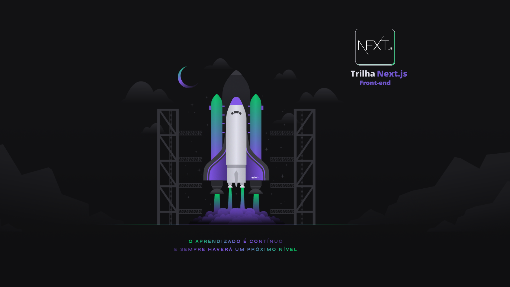
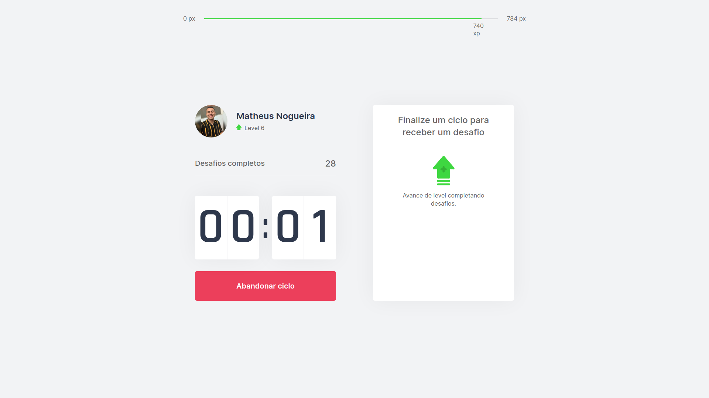
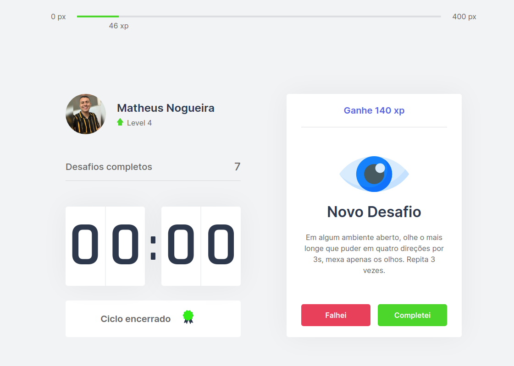
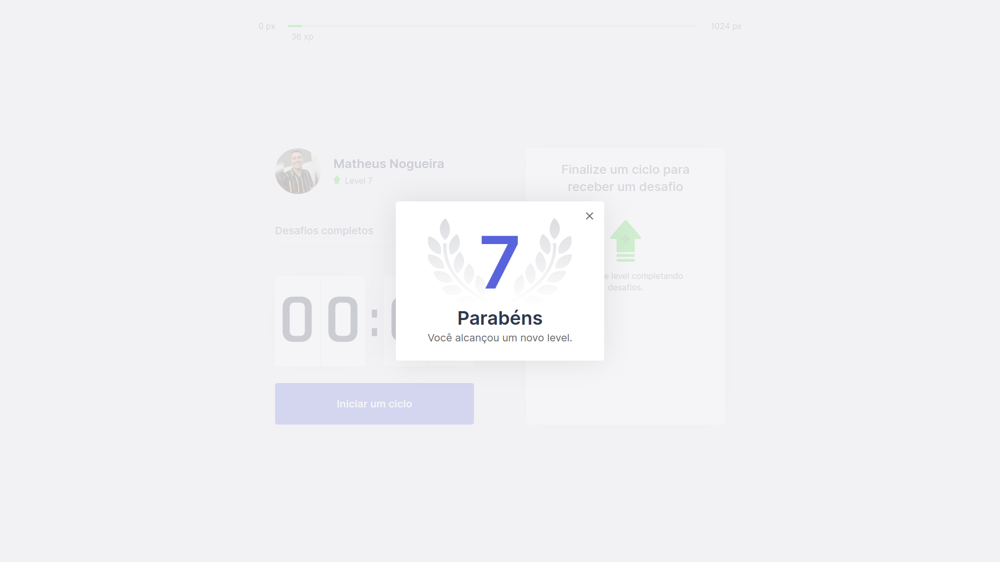

# Move.it
<div align="center">
    
</div>

<div align="center">
     
    
    
    <p>
      Feito por <a href="https://www.linkedin.com/in/matheus-nogueira-6675a751/" target="_blank">Matheus Nogueira🚀</a>.
    </p>
</div>

# :computer: Layout

<div style="display: flex; flex-direction: 'column'; align-items: 'center';">
    
    
    
    
</div>

# :pushpin: Tópicos

* [Tecnologias](#computer-tecnologias)
* [Sobre o Move.it](#dart-sobre-o-move.it)
* [Instalação | Rodando o Front-end](#construction_worker-instalação-|-rodando-o-frontend)

# :computer: Tecnologias
* [React](https://reactjs.org/)
* [Next](https://nextjs.org/)      
* [Next com typescript](https://nextjs.org/docs/basic-features/typescript)
* [TypeScript](https://www.typescriptlang.org/)

# :dart: Sobre o Move.it

O Move.it é um projeto que visa te ajudar a se concentrar em suas tarefas, porém sempre lembrando de descansar, utilizando a técnica de pomodoro, com o objetivo de melhorar sua produtividade e foco. Desenvolvido durante a Next Level Week #4 [Rocketseat](https://rocketseat.com.br/).

# :construction_worker: Instalação | Rodando o Front-end
```bash
# Copie esse comando em um terminal
$ git clone https://github.com/Matheus-HFN/moveit-next.git

# Entrar na pasta
$ cd moveit-next

# Instale as dependências
$ yarn install

# Rodar a aplicação
$ yarn dev

# O projeto inciará na porta: 3000
Para visualizar o resultado: http://localhost:3000/
```
## Licença ⚖️
Este projeto está sob a licença do MIT. Veja o arquivo [LICENSE](https://github.com/Matheus-HFN/moveit-next/blob/main/LICENSE) para mais detalhes.